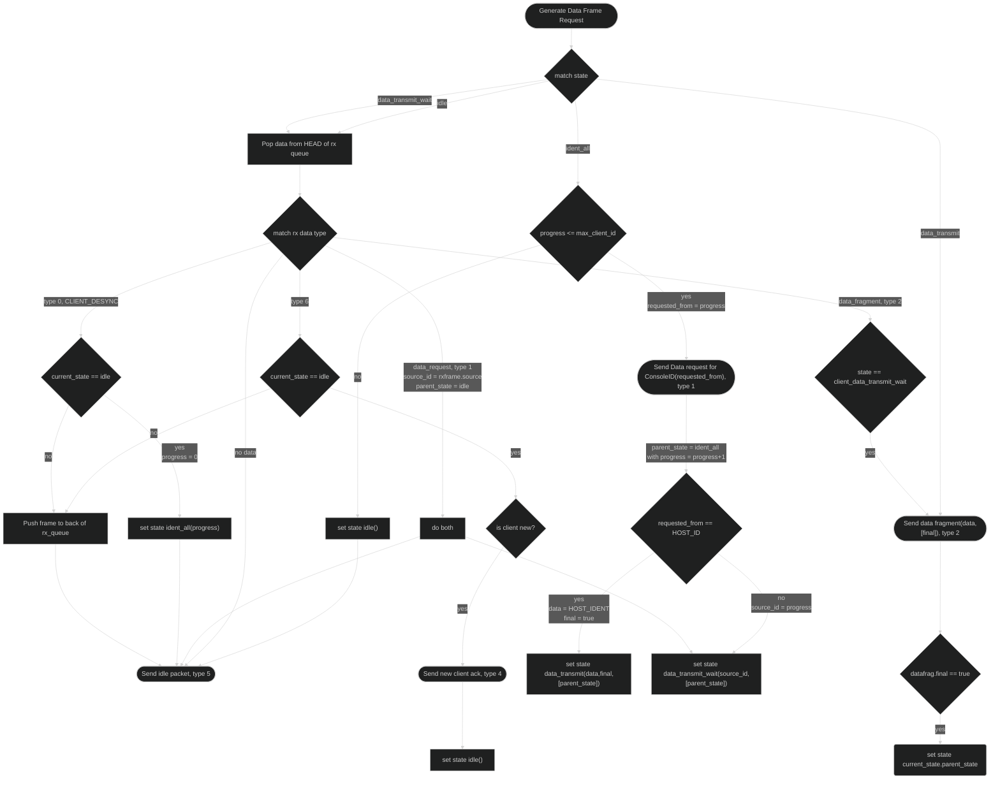
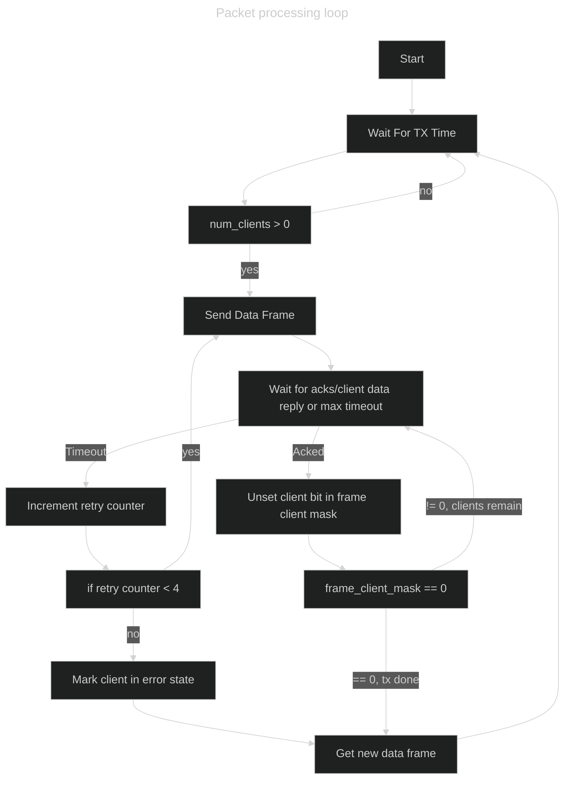

a probably wrong attempt at some diagrams

# pictochat state

```mermaid
---
titile: Pictochat State
config: 
    theme: dark
---

flowchart TB
gen_frame_req([Generate Data Frame Request])

pending_data_rx_pop["Pop data from HEAD of rx queue"]

send_data_req_console_id(["Send Data request for ConsoleID(requested_from), type 1"])
send_data_frag_console_id(["Send data fragment(data,[final]), type 2"])
send_idle(["Send idle packet, type 5"])
send_new_client_ack(["Send new client ack, type 4"])

state_client_data_transmit["set state data_transmit(data,final,[parent_state])"]
state_client_data_transmit_wait["set state data_transmit_wait(source_id,[parent_state])"]
state_idle["set state idle()"]
state_idle_and_send["set state idle()"]
state_to_parent("set state current_state.parent_state")

state_ident_all["set state ident_all(progress)"]

match_state{match state}
match_rx_type{match rx data type}
is_new_client{is client new?}

    state_idle_and_send --> send_idle
    gen_frame_req --> match_state

    match_state -->|
        idle
    |pending_data_rx_pop --> match_rx_type
    match_state -->|
        ident_all
    |ident_all_loop{progress <= max_client_id} -->|
        no
    |state_idle_and_send

    ident_all_loop -->|
        yes
        requested_from = progress
    |send_data_req_console_id -->|
        parent_state = ident_all with progress = progress+1
    | is_req_from_host{requested_from == HOST_ID} -->|
        yes
        data = HOST_IDENT
        final = true
    |state_client_data_transmit
    is_req_from_host -->|
        no
        source_id = progress
    |state_client_data_transmit_wait

    match_state  -->|
        data_transmit_wait
    |pending_data_rx_pop
    match_state -->|
        data_transmit
    |send_data_frag_console_id
    
    
    match_rx_type -->|
        no data
    |send_idle
    match_rx_type -->|
        data_request, type 1
        source_id = rxframe.source
        parent_state = idle
    |do_both["do both"]
    do_both --> send_idle
    do_both --> state_client_data_transmit_wait
    match_rx_type -->|
        data_fragment, type 2
    |is_wait_rx{state == client_data_transmit_wait} -->|
    yes
    |send_data_frag_console_id-->is_tx_over{datafrag.final == true} -->|
    yes
    |state_to_parent
    
    match_rx_type -->|
        type 6
    |state_barrier_idle_2{current_state == idle}-->|
    yes
    |is_new_client
    state_barrier_idle_2-->|no|push_frame_back_rx_queue[Push frame to back of rx_queue]

    is_new_client -->|
        yes
    |send_new_client_ack --> state_idle
    match_rx_type -->|
        type 0, CLIENT_DESYNC
        
    |state_barrier_idle{current_state == idle}-->|
    yes
    progress = 0
    |state_ident_all
    state_ident_all --> send_idle
    state_barrier_idle-->|no|push_frame_back_rx_queue[Push frame to back of rx_queue]
    push_frame_back_rx_queue --> send_idle

```

# Packet transmit and receive routine

```mermaid
---
title: "Packet processing loop"
config:
  theme: dark
---
flowchart TB
    tx_wait[Wait For TX Time]
    data_frame_has_clients[frame_client_mask == 0]
    tx_data[Send Data Frame]
    ack_wait[Wait for acks/client data reply or max timeout]
    max_ack_wait_timeout[Increment retry counter]
    ack_wait_got_ack[Unset client bit in frame client mask]
    get_new_data[Get new data frame]
    retry_counter_low[if retry counter < 4]
    mark_client_errored[Mark client in error state]
    are_clients_present[num_clients > 0]
    start[Start]
    
    start --> tx_wait
    tx_wait --> are_clients_present -->|yes| tx_data
    are_clients_present --> |no| tx_wait
    tx_data --> ack_wait
    ack_wait -->|Acked| ack_wait_got_ack
    ack_wait -->|Timeout| max_ack_wait_timeout
    max_ack_wait_timeout --> retry_counter_low
    retry_counter_low -->|yes| tx_data
    retry_counter_low -->|no| mark_client_errored --> get_new_data
    ack_wait_got_ack -->  data_frame_has_clients
    data_frame_has_clients -->|!= 0, clients remain|ack_wait
    data_frame_has_clients -->|== 0, tx done|get_new_data
    get_new_data --> tx_wait
```